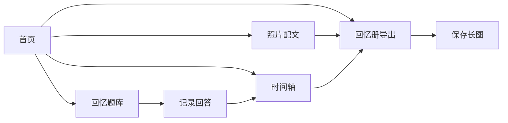

## 1. 产品概述

家庭故事采集本是一款轻量级家庭回忆记录工具，帮助用户通过结构化提问引导长辈讲述人生经历，将散落的记忆碎片整理成可保存、可分享的家庭故事集。

- **解决的问题**：家庭想记录长辈经历但常因提问无从下手而搁置
- **目标用户**：家庭记录者、年轻子女、长辈访谈者
- **产品价值**：让家庭记忆得以传承，让爱与故事被铭记

## 2. 核心功能

### 2.1 用户角色

| 角色 | 注册方式 | 核心权限 |
|------|----------|----------|
| 家庭记录者 | 无需注册，本地存储 | 创建访谈、编辑回答、导出回忆册 |

### 2.2 功能模块

1. **回忆题库**：按主题分类的提问卡片，支持随机抽取和主题筛选
2. **时间轴整理**：将回答按年代整理成节点和家庭事件线
3. **照片配文**：为老照片添加人物、地点和故事注释
4. **回忆册导出**：组合内容生成长图，支持本地保存

### 2.3 页面详情

| 页面名称 | 模块名称 | 功能描述 |
|-----------|-------------|---------------------|
| 首页 | 导航入口 | 四个功能模块入口、应用介绍、使用引导 |
| 回忆题库 | 主题筛选 | 童年、工作、婚姻、迁徙、节日等主题分类 |
| 回忆题库 | 提问卡片 | 卡片翻转效果、收藏、记录回答 |
| 时间轴 | 年代节点 | 纵向时间轴、事件卡片、年代标签 |
| 时间轴 | 添加事件 | 表单填写事件名称、年代、描述、关联人物 |
| 照片配文 | 照片列表 | 照片网格展示、上传入口 |
| 照片配文 | 照片详情 | 添加人物、地点、年份、故事注释 |
| 回忆册 | 内容编排 | 选择要包含的故事和照片 |
| 回忆册 | 预览导出 | 长图预览、一键下载保存 |

## 3. 核心流程

用户从首页进入任意功能模块，可独立使用也可串联使用。典型流程：从回忆题库抽题访谈 → 记录回答 → 将重要回答添加到时间轴 → 上传老照片并配文 → 组合内容生成回忆册 → 导出保存。

## 4. 用户界面设计

### 4.1 设计风格

- **主色调**：暖棕色系（#8B5A2B 主色），搭配米白色背景（#FDF8F0），营造温暖怀旧的家庭氛围
- **辅助色**：暗红色（#C04848）作为强调色，用于重要按钮和高亮元素
- **按钮风格**：圆角矩形，轻微阴影，悬停时有微上浮效果
- **字体**：标题使用衬线字体（Noto Serif SC），正文使用圆润无衬线（Noto Sans SC）
- **布局风格**：卡片式布局，模拟实体相册和笔记本的质感
- **图标风格**：线性图标，统一圆角风格，搭配温暖色调

### 4.2 页面设计概述

| 页面名称 | 模块名称 | UI元素 |
|-----------|-------------|-------------|
| 首页 | 功能入口 | 四大功能卡片、大标题、温暖背景纹理、渐入动画 |
| 回忆题库 | 主题筛选 | 横向滚动标签、选中态高亮、卡片流布局 |
| 回忆题库 | 提问卡片 | 翻转动画、问题在正面、回答输入在背面、收藏按钮 |
| 时间轴 | 时间线 | 竖线贯穿、圆点节点、左右交错卡片、年代标签 |
| 照片配文 | 照片墙 | 瀑布流/网格布局、悬停放大效果、上传按钮 |
| 回忆册 | 预览 | 长卷轴效果、可滚动预览、导出按钮动效 |

### 4.3 响应式

- 桌面端优先设计，兼顾平板和移动端适配
- 卡片在移动端变为单列布局
- 触摸优化：增大点击区域，支持滑动切换卡片
