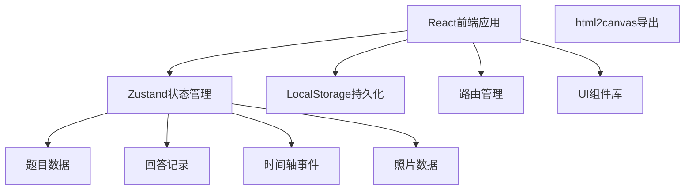

## 1. 架构设计



## 2. 技术描述

- **前端框架**：React@18 + TypeScript + Vite
- **样式方案**：TailwindCSS@3
- **状态管理**：Zustand
- **路由**：React Router DOM
- **图标**：Lucide React
- **图片导出**：html2canvas
- **数据持久化**：LocalStorage（纯前端，无需后端）
- **初始化工具**：vite-init

## 3. 路由定义

| 路由 | 用途 |
|-------|---------|
| / | 首页，功能导航入口 |
| /questions | 回忆题库页面 |
| /timeline | 时间轴页面 |
| /photos | 照片配文页面 |
| /album | 回忆册导出页面 |

## 4. 数据模型

### 4.1 数据类型定义

```typescript
// 题目分类
type QuestionCategory = 'childhood' | 'work' | 'marriage' | 'migration' | 'festival' | 'other';

// 问题
interface Question {
  id: string;
  category: QuestionCategory;
  content: string;
  hint?: string;
}

// 回答记录
interface Answer {
  id: string;
  questionId: string;
  questionContent: string;
  content: string;
  createdAt: number;
  favorite: boolean;
  year?: string;
}

// 时间轴事件
interface TimelineEvent {
  id: string;
  year: string;
  title: string;
  description: string;
  people?: string;
  location?: string;
  photoIds?: string[];
}

// 照片
interface Photo {
  id: string;
  dataUrl: string;
  title: string;
  people: string;
  location: string;
  year: string;
  story: string;
  createdAt: number;
}
```

### 4.2 Store 状态结构

```typescript
interface AppState {
  questions: Question[];
  answers: Answer[];
  timelineEvents: TimelineEvent[];
  photos: Photo[];
  currentCategory: QuestionCategory | 'all';
  addAnswer: (answer: Omit<Answer, 'id' | 'createdAt'>) => void;
  toggleFavorite: (id: string) => void;
  addTimelineEvent: (event: Omit<TimelineEvent, 'id'>) => void;
  addPhoto: (photo: Omit<Photo, 'id' | 'createdAt'>) => void;
  updatePhoto: (id: string, updates: Partial<Photo>) => void;
}
```

## 5. 项目结构

```
src/
├── components/          # 可复用组件
│   ├── QuestionCard.tsx    # 题目卡片
│   ├── TimelineNode.tsx  # 时间轴节点
│   ├── PhotoCard.tsx     # 照片卡片
│   ├── Layout.tsx        # 布局组件
│   └── NavBar.tsx        # 导航栏
├── pages/               # 页面组件
│   ├── Home.tsx          # 首页
│   ├── Questions.tsx     # 回忆题库
│   ├── Timeline.tsx       # 时间轴
│   ├── Photos.tsx         # 照片配文
│   └── Album.tsx          # 回忆册
├── store/               # 状态管理
│   └── useStore.ts
├── data/                # 静态数据
│   └── questions.ts      # 题目库数据
├── utils/               # 工具函数
│   ├── storage.ts        # LocalStorage封装
│   └── export.ts         # 导出相关工具
├── App.tsx
├── main.tsx
└── index.css
```

## 6. 核心技术方案

### 6.1 回忆题库
- 预置多主题问题库（约50-80道题目）
- 卡片翻转动画使用CSS 3D transform
- 支持按主题筛选和随机抽取

### 6.2 时间轴
- 纵向时间轴布局，事件按年份排序
- 左右交错卡片布局
- 支持添加、编辑、删除事件

### 6.3 照片配文
- 使用FileReader读取本地图片，转为base64存储
- 支持添加人物、地点、年份、故事注释
- LocalStorage存储（注意容量限制）

### 6.4 回忆册导出
- 使用html2canvas将DOM转为图片
- 组合题目回答 + 时间轴 + 照片生成纵向长图
- 支持下载保存到本地
